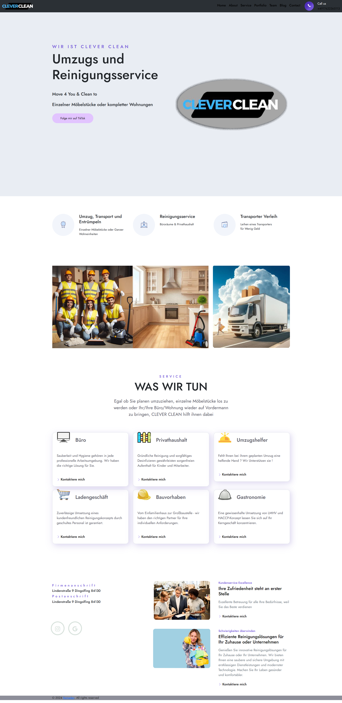

# Clean-Firma-Webseite 🧹🌟

Clean-Firma-Webseite is a project aimed at developing a sleek and organized website for a specific company or organization. The project utilizes HTML, CSS, and JavaScript to create a responsive and user-friendly web experience.

## Features

- *Sleek Design*: Clean and attractive user interface design for easy navigation.
- *Responsive*: The website is designed to be responsive and adapt to various screen sizes.
- *Dynamic Content*: Utilizes JavaScript to add dynamic and interactive elements to the website.
- *Customizable*: Easily customizable to meet the specific needs and branding of any company or organization.

### Demo



## Getting Started
To get started with Clean-Firma-Webseite, simply clone the repository to your local machine:

```bash
git clone https://github.com/abdulrahim-ramadan/Clean-Firma-Webseite.git 


